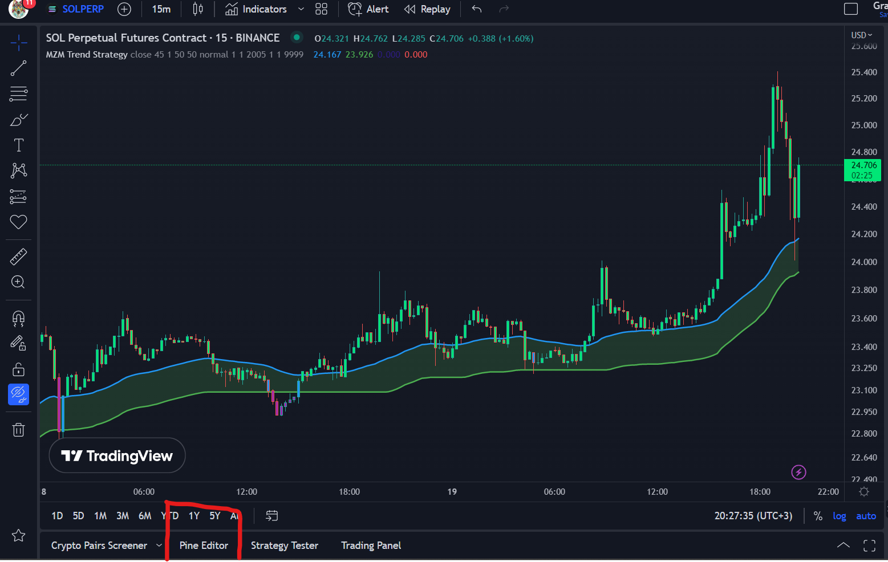
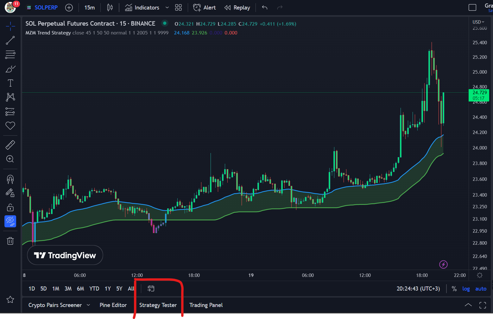
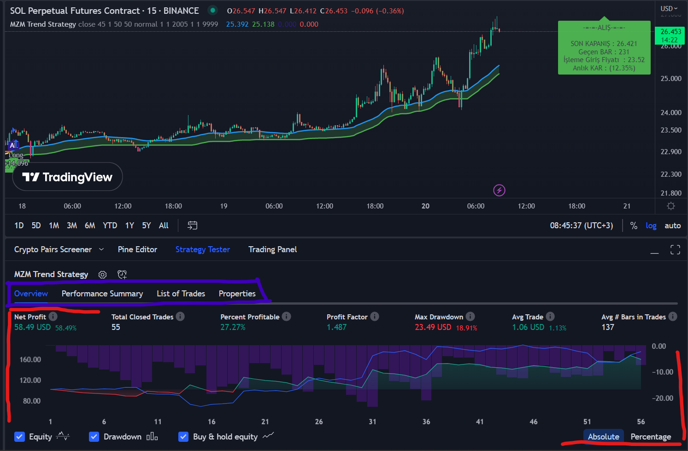
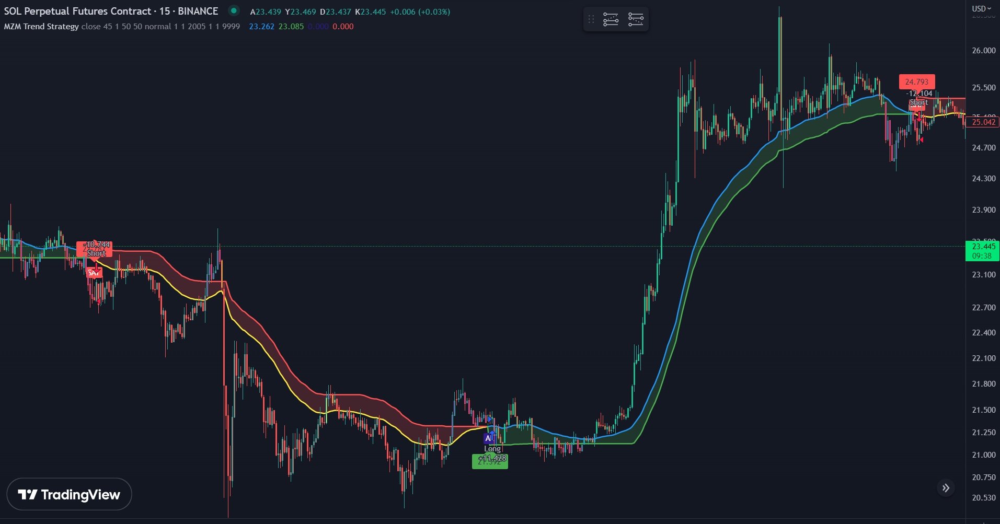
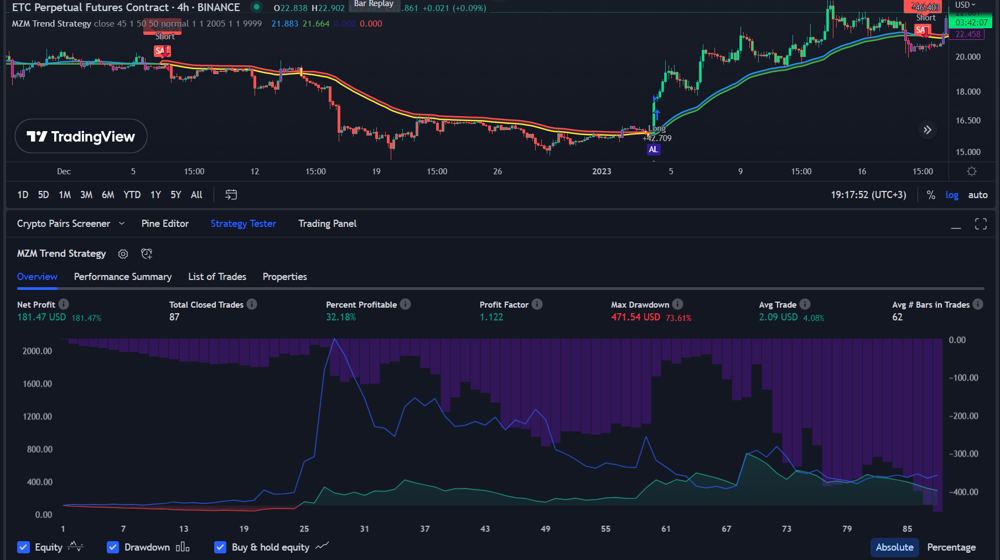

# MZM-Trend-Strategy
---

> Önemli Not: Indikatörüme ait kodları ve eğitim metnini sizlerle paylaşıyorum, böylece kendi analiz yöntemlerinizi geliştirebilir ve indikatörü özelleştirebilirsiniz. Ancak, kodları ve eğitim metnini paylaşırken, lütfen unutmayın ki indikatörün başarısı, piyasanın değişken koşullarına ve belirli parametrelere bağlıdır. Kendi risk profilinizi dikkate alarak indikatörü kullanmanız ve işlem yapmadan önce kendi araştırmanızı yapmanız önemlidir. Kodların kullanımı ve uygulanması, sizin sorumluluğunuzdadır ve ben, kodların kullanımından kaynaklanan herhangi bir zarardan sorumlu değilim. Umarım kodları ve eğitim metnini faydalı bulursunuz ve bunları kullanarak kendi yatırım stratejilerinizi geliştirirsiniz. Başarılar! :)

---

Her yatırımcı, yatırımlarını emanet etmeyi düşündüğü varlığın hem teknik hem de temel analizini öğrenmek ister. Zira doğru zamanda alıp satmak, borsada zaman geçirenlerin önemsediği konulardan biridir.

İndikatör, teknik analiz göstergeleri olarak tanımlanabilir. Bu göstergeler, söz konusu finansal varlıklar için alım satım sinyalleri verirler. Kısacası, indikatörleri kullanarak matematiksel verilere erişerek gelecekteki fiyatları daha az hata payı ile tahmin edebiliriz.

Yatırım dünyasında, doğru yatırım kararlarını vermek için teknik analiz araçlarından yararlanılır. Bu araçların en popüler olanlarından biri olan indikatörler, geçmiş fiyat hareketlerini ve hacim bilgileri gibi verileri kullanarak gelecekteki fiyatları tahmin etmek için tasarlanmış matematiksel formüllerdir. Ancak, piyasada birçok indikatörün doğru sonuç vermediği ve yatırımcılara yanıltıcı sinyaller verdiği bir gerçektir. Bu nedenle, özellikle deneyimli yatırımcılar, kendi ihtiyaçlarına ve yatırım stratejilerine uygun şekilde çalışacak özel indikatörler geliştirmeye eğilimlidirler.

Geri boyama yapmayan ve istenilen koşullara göre çalışan indikatörler, yatırımcıların daha doğru yatırım kararları almasına yardımcı olabilir. Ancak, bu tür indikatörlerin oluşturulması, programlama becerisi ve teknik analiz bilgisi gerektirdiği için geliştirme süreci diğer indikatörlere göre daha uzun ve zahmetlidir.

Bu indikatörümü geliştirirken, benzer özelliklere sahip mevcut indikatörlere başvurarak işe başladım. Özellikle, "_Moving Average_" (Hareketli Ortalama), "_Exponential Moving Average_" (Üstel Hareketli Ortalama), _MOST_(Moving Stop Loss Indicator) gibi önde gelen indikatörlerin özelliklerinden faydalandım. Hareketli ortalama, fiyatların belirli bir dönemdeki ortalamasını hesaplar ve bu sayede fiyat trendlerini ve yönlerini gösterir. Üstel hareketli ortalama ise, son fiyatlara daha fazla ağırlık verir ve daha hızlı bir yanıt verir.

Benim geliştirdiğim indikatörde, bu özelliklerin yanı sıra, en önemli noktalardan biri geri boyamayı önlemekti. Geri boyama, geçmiş fiyat verilerine dayalı olarak yapılan tahminlerde görülen yanıltıcı bir etkidir ve piyasa koşullarının değişmesi ile birlikte yanıltıcı sonuçlar ortaya çıkarabilir.

Sonuç olarak, mevcut indikatörlerin özelliklerinden faydalanarak ve geri boyamayı önleme özelliğine odaklanarak, piyasada daha doğru sonuçlar verebilecek yeni bir indikatör geliştirmeye çalıştım. Bu indikatör, yatırımcılara fiyat trendleri ve yönlerine dair daha doğru bilgiler sağlayarak, yatırım kararlarını daha bilinçli bir şekilde almalarına yardımcı olabilir.

> Not: Farklı varlıklar ve zaman dilimlerinde kullanılabilen bu indikatör, önceden optimize edilmeden kullanılmamalıdır. Varsayılan sürümü ne kadar başarılı olursa olsun, büyük olasılıkla, belirlenen zaman dilimine ve varlığa özgü bir optimizasyon çalışması sonrası kârlılık oranı artacaktır.

---

## **İndikatörün Grafiğe Eklenmesi**
1- Resimde kırmızı kutu içerisine alınmış olan `Pine Editor` bölümünü açıyoruz.


2- Resimde kırmızı kutu içerisine alınmış olan bölüm kodlarımızı yazacağımız yerdir. Bu kısıma kopyaladığımız kodu yapıştırıyoruz. Daha sonra mavi kutu içerisine alınmış bölümde `Save` butonuna basıyoruz `Add to chart` butonuna basarak grafiğimize ekliyoruz.


---

## **İndikatöre Back Test Yapılması**
1- Resimde kırmızı kutu içerisine alınmış olan `Strategy Tester` bölümünü açıyoruz.


2- Resimde mavi kutu içerisine alınmış olan bölümde stratejimizin genel performansının gösterildiği `Overview` bölümü, preformans özetinin gösterildiği `Performance Summary` bölümü, yapılan işlemlerin listesinin gösterildiği `List of Trades` bölümü ve stratejimizin hangi özelliklere göre çalıştığının gösterildiği `Propeties` bölümü bulunuyor. Kırımızı kutuda net kazancımızın gösterildiği `Net Profit` bölümü, kaç adet işlem yapıldığını gösteren `Total Closed Trades` bölümü, kâr eden işlemlerin yüzdelik oranını gösteren `Percent Profitable` bölümü, kaybedilen her birim para için kazanılan birim para miktarının gösterildiği `Profit Factor` bölümü, stratejimizin işlemleri sırasında yaptığı en büyük kaybın gösterildiği `Max Drawdown` bölümü, işlem başına ortalama kazanılan veya kaybedilen paranın gösterildiği `Avg Trade` bölümü ve stratejimizin ortalama olarak kaç bar işlemde kaldığını gösteren `Avg # Bars in Trades` bölümü bulunmaktadır.


3- Sizin trade stratejinize uygun olarak indikatörün girdilerini değiştirerek back test ile isteğinize en uygun(örn. kazancım çok olsun kârlı yüzde önemli değil ya da kâr ettiğim işlem sayısı fazla olsun zararlı işlem sevmiyorum, benim için kazanç ikinci plan gibi...) şekilde optimizasyon yapabilirsiniz.

---

Şimdi biraz indikatördeki görsel alanların neye karşılık geldiğine bakalım;

- **_Mavi-Sarı ve Yeşil-Kırmızı Çizgiler_**: Mavi-Sarı _Exponential Moving Average_ (Üstel Hareketli Ortalama) ve Yeşil-Kırmızı *MOST*(Moving Stop Loss Indicator) sınır çizgileridir.

  - Eğer ExMov, MOST çizgilerinin üstüne çıkarsa ExMov çizgisi mavi olurken MOST çizgisi yeşil olur. Bu yükseliş trendine işaret eder ve çizgiler arasında kalan alan yeşile boyanır.
  - Eğer ExMov, MOST çizgilerinin altına inerse ExMov çizgisi sarı olurken MOST çizgisi kırmızı olur. Bu düşüş trendine işaret eder ve çizgiler arasında kalan alan kırmızıya boyanır.

- **_Yeşil Bar_**: Mavi çizgi, yeşil çizginin üzerindeyse ve yeşil çizgi kapanış değerinden küçükse ve en düşük gün değeri yeşil çizgiden büyükse, bar _`yeşil`_ olsun.

- **_Mavi Bar_** : Mavi çizgi yeşil çizginin üzerindeyse ve yeşil çizgi kapanış değerinden küçükse ve en düşük gün değeri yeşil çizgiden küçükse bar _`mavi`_ olsun.

- **_Kırmızı Bar_** : Kırmızı çizgi sarı çizginin üzerindeyse ve bar kapanış değeri kırmızı çizginin altındaysa ve en yüksek gün değeri kırmızı çizginin altındaysa bar _`kırmızı`_ olsun.

- **_Sarı Bar_** : Kırmızı çizgi sarı çizginin üzerindeyse ve bar kapanış değeri kırmızı çizginin altındaysa ve en yüksek gün değeri kırmızı çizginin üstündeyse bar _`sarı`_ olsun.

- **_Gri Bar_** : Hiçbir koşul karşılanmıyorsa bar _`gri`_ olsun. Mum yukarıdan aşağı kesiyorsa trend aşağıya dönüyor demektir. Aşağıdan yukarı kesiyorsa trend yukarı dönüyor demektir.

---

Birkaç tane örnek işlem ve strateji performansı görseline bakalım.






---

Şimdi bu indikatörü yazarken kullandığım programlama dili olan Pine Script'in ne olduğuna ve bu indikatörü kodlarken kullandığım özelliklerine göz atalım.

## `Pine Script` Nedir?

TradingView tarafından geliştirilen `Pine Script`, teknik analizde kullanılabilen özel göstergeler ve stratejiler yazmak için grafiğinize eklenebilen bir programlama dilidir.

Alt panelinizde yer alan özel düzenleyici, kod yazmak ve düzenlemek için özellikle tasarlanmıştır ve değişkenleri, işlevleri ve araç ipuçlarını vurgulamak için otomatik bir vurgulayıcı işlevi görebilir. Bu otomatik vurgulayıcı, dilin yerleşik öğelerini (değişkenler ve işlevler) otomatik olarak vurgular ve imlecinizle belirli öğelerin üzerine geldiğinizde açılır pencerelerde görünen ek bilgilerle ipuçları gönderir.

Şimdi bu stratejiyi yazarken kullandığım Pine Script Operatörleri, Değişkenleri ve Fonksiyonları hakkında bilgi vereceğim:

---

## **`strategy`**

Bu fonksiyon bir dizi strateji özelliği belirler.

```
strategy(title, shorttitle, overlay, format, precision, scale, pyramiding, calc_on_order_fills, calc_on_every_tick, max_bars_back, backtest_fill_limits_assumption, default_qty_type, default_qty_value, initial_capital, currency, max_lines_count, max_labels_count, slippage, commission_type, commission_value, process_orders_on_close, close_entries_rule, margin_long, margin_short, max_boxes_count, explicit_plot_zorder) → void
```

**ÖRNEK**

```
strategy("MZM Trend Strategy",shorttitle="MZM Trend Strategy",overlay=true)
```

**`Argümanlar`**

- `title (const string)`: Göstergeler/Stratejiler widgetinde görünecek çalışma başlığıdır. Argümanın kullanımı ZORUNLUDUR.

- `shorttitle (const string)`: `study short title` grafik lejantında görünecek kısa çalışma başlığıdır. Argümanın kullanımı opsiyoneldir.

- `overlay (const bool)`: eğer `true` ise çalışma ana dizi üzerine bir katman olarak eklenecektir. false ise - farklı bir çizim panosuna eklenir. Varsayılan değer false'tur.

---

## **`input`**

`input` kodunuza bir girdi ilave eder. Kod çalışmasının `Format Object` penceresinden girdileri görüp düzenleyebilirsiniz. Komut girdileri _Hazır Teknik Analiz Gösterge Girdileri_ ile aynı görünür ve davranır.

**ÖRNEK**

```
AP2 = input(defval=14,title="Length",minval=1)
```

**`Argümanlar`**

- `defval` _(Türü, "type" parametresinin değeriyle tanımlanan türle eşleşmelidir.)_: Komut dosyasının "Settings/Inputs" sekmesinde önerilen, kullanıcının değiştirebileceği giriş değişkeninin varsayılan değerini belirler.
- `title (const string)`: Girişin başlığıdır. Belirtilmezse, değişken adı girişin başlığı olarak kullanılır. Başlık belirtilmişse ancak boşsa, ad empty string olacaktır.
- `minval (const integer, float)`: Giriş değişkeninin olası en küçük değeridir. Bu argüman giriş değeri sadece `input.integer` veya `input.float` olduğunda kullanılır.

---

## **`ema`**

Ema işlevi, üssel ağırlıklı hareketli ortalamayı döndürür. Ema'da ağırlıklandırma faktörleri katlanarak azalır. Şu formülü kullanarak hesaplar:
`EMA = alfa * x + (1 - alfa) * EMA [1]`, burada `alfa = 2 / (y + 1)` 'dır.

```
ema(source, length) → series[float]
```

**ÖRNEK**

```
Trail1 = ema(src,AP2)
```

**`Argümanlar`**

- `source (series)`: İşlenecek değerler.
- `length (integer)`: Çubuk sayısı (uzunluk).

---

## **`iff`**

Diğer programlama dillerindeki `if` koşul yapısının Pine Script karşılığıdır. Tanımlanışı aşağıdaki gibidir.

```
iff(condition, then, _else)
```

yani ;
`iff(durum, durum true ise dönülecek şey, durum false ise dönülecek şey)`

> Not: \_else kullanmaya ihtiyacınız yoksa o bölüme `na` yazabilirsiniz.

**ÖRNEK**

```
iff(plotcolor == 1, Blue ? color.blue : Green ? color.lime : Yellow ? color.yellow : Red ? color.red : color.purple, na)
```

**`Argümanlar`**

- `condition (series)`: Koşul değerleriyle dizilerdir. Sıfır değer (0 ve ayrıca NaN, +Sonsuz, -Sonsuz) `false` olarak değerlendirilir, diğer tüm değerler `true`'dur.

- `then (series)`: Koşul `true` ise değerleriyle dönülecek dizi.

- `_else (series)`: Koşul `false` ise değeri dönülecek olan dizi.

---

## **`nz`**

Bir dizideki `NaN` değerlerini sıfırlarla (veya verilen değerle) değiştirir.

**ÖRNEK**

```
nz(Trail2[1],0)
```

**Çıktılar**

- İki argümanlı versiyon(`nz(x, y)`) : Eğer geçerli bir sayı ise (`NaN değil`) x döner, aksi durumda y döner.
- Tek argüman versiyonu(`nz(x)`): Eğer geçerli bir sayı ise (`NaN değil`) x değeri döner, aksi durumda 0 döner.

**`Argümanlar`**

- `x (series)`: İşlenecek değer dizisi.
- `y (float)`: x dizisindeki `NaN` değerleri yerine konacak değer.

---

## **`max`**

Birden çok değerden en büyük olanını sonuçlandırır.

**ÖRNEK**

```
max(nz(Trail2[1],0),Trail1-SL2)
```

---

## **`min`**

Birden çok değerden en küçük olanını sonuçlandırır.

**ÖRNEK**

```
min(nz(Trail2[1],0),Trail1+SL2)
```

---

## **`close`**

Geçerli çubuğun kapandığı andaki kapanış fiyatı veya henüz tamamlanmamış bir gerçek zamanlı çubuğun son işlem fiyatı.

**ÖRNEK**

```
Green = Trail1 > Trail2 and close > Trail2 and low > Trail2
```

> Not: Önceki değerlere kare parantez operatörü `[]` ile erişilebilir, örneğin` close[1]`, `close[2]`.

---

## **`low`**

Mevcut düşük fiyat.

**ÖRNEK**

```
Green = Trail1 > Trail2 and close > Trail2 and low > Trail2
```

> Not: Önceki değerlere kare parantez operatörü `[]` ile erişilebilir, örneğin` low[1]`, `low[2]`.

---

## **`high`**

Mevcut yüksek fiyat.

**ÖRNEK**

```
Red = Trail2 > Trail1 and close < Trail2 and high < Trail2
```

> Not: Önceki değerlere kare parantez operatörü `[]` ile erişilebilir, örneğin` high[1]`, `high[2]`.

---

## **`barssince`**

Koşulun en son doğru olduğu zamandan bu yana geçen çubuk sayısını sayar.
Aşağıdaki gibi oluşturulur;
`barssince(condition) → series[integer]`

**ÖRNEK**

```
Bull = barssince(Green)<barssince(Red)
```

**Çıktılar**

Koşul doğru olduğundan beri geçen çubuk sayısı.

> Not: Mevcut çubuktan önce koşul hiç karşılanmadıysa, function na değerini döndürür.

---

## **`crossover`**

Eğer `x` değerleri `y` değerlerinden büyük ve mevcut çubuktan önceki çubuktaki `x` değeri `y` değerinden küçükse `x` dizisi `y` dizisini aşağı kesiyor olarak tanımlanır.

**ÖRNEK**

```
Buy = crossover(Trail1, Trail2)
```

**Çıktılar**
`x` , `y` değerini yukarı kesti ise true, aksi durumda false

**`Argümanlar`**

- x (float) `x` veri dizisi
- y (float) `y` veri dizisi

---

## **`crossunder`**

Eğer 'x' değerleri 'y' değerlerinden küçük ve mevcut çubuktan önceki çubuktaki 'x' değeri 'y' değerinden büyükse 'x' dizisi 'y' dizisini aşağı kesiyor olarak tanımlanır.

**ÖRNEK**

```
Sell = crossunder(Trail1, Trail2)
```

**Çıktılar**
`x` , `y` değerini aşağı kesti ise true, aksi durumda false

**`Argümanlar`**

- x (float) `x` veri dizisi
- y (float) `y` veri dizisi

---

## **`plot`**

Grafik üzerinde bir data dizisi çizer.
Aşağıdaki gibi tanımlanır;

```
plot(series, title, color, linewidth, style, trackprice, transp, histbase, offset, join, editable, show_last, display) → plot`
```

**ÖRNEK**

```
TS1 = plot(Trail1, "ExMov", style=plot.style_line,color=Trail1 > Trail2 ? color.blue : color.yellow, linewidth=2)
```

**Çıktılar**
`fill` ile kullanılabilecek bir çizim nesnesi

---

## **`fill`**

İki veri serisi çizimi veya yatay çizgi arasındaki arka planı verilen renkle doldurur.
Aşağıdaki gibi tanımlanır;

```
fill(hline1, hline2, color, transp, title, editable, fillgaps) → void

fill(plot1, plot2, color, transp, title, editable, show_last, fillgaps) → void
```

**ÖRNEK**

```
fill(TS1,TS2,Bull ? color.green : color.red, transp=90)
```

**`Argümanlar`**

- `hline1 (hline)`: İlk hline nesnesi. Gerekli bir argüman.
- `hline2 (hline)`: İkinci hline nesnesi. Gerekli bir argüman.
- `plot1 (plot)`: İlk çizim nesnesi. Gerekli bir argüman.
- `plot2 (plot)`: İkinci çizim nesnesi. Gerekli bir argüman.
- `color (color)`: Çizim rengi. '`color=color.red`' veya '`color=#ff001a`' sabitleri ya da daha karmaşık şekilde '`color = close >= open ? color.green : color.red`' gibi ifadeleri kullanabilirsiniz. Opsiyonel bir argümandır.
- `transp (input integer)`: Arkaplan dolumunun transparanlığı. Olası değerler 0'dan (transparan değil) 100'e (görünmez). Opsiyonel argüman.

---

## **`barcolor`**

Çubukların rengini belirler.
Aşağıdaki gibi tanımlanır;

```
barcolor(color, offset, editable, show_last, title) → void
```

**ÖRNEK**

```
bcl = iff(plotcolor == 1, Blue ? color.blue : Green ? color.lime : Yellow ? color.yellow : Red ? color.red : color.purple, na)

barcolor(bcl)
```

---

## **`tostring`**

`x` argümanının String olarak gösterimini sağlar.
Aşağıdaki gibi tanımlanır;

```
tostring(x) → series[string]
tostring(x, y) → series[string]
tostring(x) → string
tostring(x, y) → string
```

**ÖRNEK**

```
aldigimfiyat=tostring(valuewhen(Buy,src,0))
```

**`Argümanlar`**

- `x (integer, float, bool, string, array ID)`: Değer veya öğeleri dizeye dönüştürülen `int[]`, `float[]`, `bool[]` veya `string[]` türündeki dizi kimliği.
- `y (string)` Biçim dizesi. Bu formatları kabul eder.\* sabitleri: `format.mintick`, `format.percent`, `format.volume`. İsteğe bağlı. Varsayılan değer '`#.##########`' şeklindedir.

---

## **`valuewhen`**

Koşul en son meydana gelen n. olayda doğru olduğunda kaynak seri değeri
Aşağıdaki gibi tanımlanır;

```
valuewhen(condition, source, occurrence) → series[float]
valuewhen(condition, source, occurrence) → series[integer]
```

**ÖRNEK**

```
aldigimfiyat=tostring(valuewhen(Buy,src,0))
```

---

## **` label.new, label.set_text, label.set_color, label.set_yloc, label.set_style, label.delete`**

`label.new` = Yeni etiket nesnesi oluşturur.
`label.set_text` = Etiket metnini ayarlar
`label.set_color` = Etiket kenarlığını ve ok rengini ayarlar.
`label.set_yloc` = Yeni y-location hesaplama algoritmasını kurar.
`label.set_style` = Etiket stilini ayarlar.
`label.delete` = Belirtilen etiket nesnesini siler. Zaten silinmişse, hiçbir şey yapmaz.

**ÖRNEK**

```
    label.new(bar_index, na)
    label.set_text(l, sattigimfiyat)
    label.set_color(l, color.red)
    label.set_yloc(l, yloc.abovebar)
    label.set_style(l, label.style_labeldown)
    label.delete(info_panellongbuy[1])

```

---

## **`plotshape`**

Grafik üzerinde görsel bir şekiller çizer.
Aşağıdaki gibi tanımlanır;

```
plotshape(series, title, style, location, color, transp, offset, text, textcolor, editable, size, show_last, display) → void
```

**ÖRNEK**

```
plotshape(Buy and plotbuysell == 1,"AL", text="AL", location=location.belowbar, style=shape.labelup, size=size.tiny, color=color.navy, textcolor=color.white, transp=0)
```

**`Argümanlar`**

- `series (series)`: Şekiller olarak gösterilecek data serisi. `location.absolute` haricinde tüm lokasyonlarında boolean değerlerden oluşan bir olarak işlem görür. Gerekli bir argüman.
- `title (const string)`: Çizimin başlığı.
- `text (const string)`: Şekille birlikte görüntülenecek metin. Çok satırlı metin kullanabilirsiniz, satırları ayırmak için '`\n`' kaçış dizisi. Örnek: '`birinci satır\nsatır iki`'.
- `style (input string)`: Plot tipi. Olası değerler : `shape.xcross, shape.cross, shape.triangleup, shape.triangledown, shape.flag, shape.circle, shape.arrowup, shape.arrowdown, shape.labelup, shape.labeldown, shape.square, shape.diamond`. Varsayılan değer `shape.xcross`.
- `location (input string)`: Grafik üzerindeki şekillerin lokasyonu. Olası değerler: `location.abovebar, location.belowbar, location.top, location.bottom, location.absolute`. Varsayılan değer: `location.abovebar`.
- `color (color)`: Şekillerin rengi. '`color=color.red`' veya '`color=#ff001a`' sabitleri ya da daha karmaşık şekilde '`color = close >= open ? color.green : color.red`' gibi ifadeleri kullanabilirsiniz. Opsiyonel bir argümandır.
- `size (const string)`: Grafik üzerindeki şekillerin `Size` değeri. Olası değerler : `size.auto, size.tiny, size.small, size.normal, size.large, size.huge`. Varsayılan değer `size.auto`.
- `textcolor (color)`: Metin rengi. '`color=color.red`' veya '`color=#ff001a`' sabitleri ya da daha karmaşık şekilde '`color = close >= open ? color.green : color.red`' gibi ifadeleri kullanabilirsiniz. Opsiyonel bir argümandır.
- `transp (input integer)`: Şekillerin transparanlığı. Olası değerler 0'dan (transparan değil) 100'e (görünmez). Opsiyonel argüman.

---

## **`round`**

En yakın tam sayıya yuvarlanmış x değerini döndürür, virgülden sonraki sayı yukarı yuvarlanır. `precision` parametresi kullanılırsa, bu ondalık basamak sayısına yuvarlanmış bir kayan nokta değeri döndürür.
Aşağıdaki gibi tanımlanır;

```
round(x) → integer
round(x) → input integer
round(x) → const integer
round(x) → series[integer]
round(number, precision) → float
round(number, precision) → input float
round(number, precision) → const float
round(number, precision) → series[float]
```

**ÖRNEK**

```
round(x / syminfo.mintick)
```

**`Argümanlar`**

- `x (series)`: Yuvarlanacak değer.
- `precision` (integer): İsteğe bağlı argüman. X'in yuvarlanacağı ondalık basamak. Bağımsız değişken sağlanmadığında, yuvarlama en yakın tam sayıya yapılır.

> `syminfo.mintick` : Mevcut sembol için minimum fiyat adımı değeri.

---

## **`pow`**

Matematiksel üstel fonksiyonu.
Aşağıdaki gibi tanımlanır;

```
pow(base, exponent) → float
pow(base, exponent) → input float
pow(base, exponent) → const float
pow(base, exponent) → series[float]
```

**ÖRNEK**

```
pow(10,_decimals)
```

**`Argümanlar`**

- `base (series[float])`: Kullanılacak bazı belirtin.
- `exponent (float)`: Üssü tanımlar.

---

## **`timenow`**

UNIX formatında şimdiki zaman. 1 Ocak 1970 00:00:00 UTC'den beri geçen milisaniye sayısıdır.
Aşağıdaki gibi tanımlanır;

**ÖRNEK**

```
info_panel_x = timenow + round(change(time)*info_label_off)+10
```

---

## **`xloc.bar_time`**

`line.new` ve `label.new` fonksiyonlarında x-değerinin yorumlanma algoritmasını belirtmesi için adlandırılmış bir sabit. Eğer `xloc = xloc.bar_time` ise, x'in değeri bir UNIX zamanıdır.

**ÖRNEK**

```
 xloc=xloc.bar_time
```

---

## **`timestamp`**

timestamp fonksiyonu belirtilen tarih ve zaman için UNIX zamanının döner.
Aşağıdaki gibi tanımlanır;

```
timestamp(dateString) → const integer
timestamp(year, month, day, hour, minute, second) → integer
timestamp(timezone, year, month, day, hour, minute, second) → integer
timestamp(year, month, day, hour, minute, second) → series[integer]
timestamp(timezone, year, month, day, hour, minute, second) → series[integer]
```

**ÖRNEK**

```
timestamp(FromYear, FromMonth, FromDay, 00, 00)
```

**`Argümanlar`**

- `timezone (string)`: Saat dilimi. İsteğe bağlı. Varsayılan, `syminfo.timezone` şeklindedir. GMT notasyonunda (ör. "GMT-5") veya bir IANA saat dilimi veritabanı adı (ör. "America/New_York") olarak belirtilebilir.
- `year (integer)`: Yıl.
- `month (integer)`: Ay.
- `day (integer)`: Gün.
- `hour (integer)`: (İsteğe bağlı argüman) Saat. Varsayılan 0'dır.
- `minute (integer)`: (İsteğe bağlı argüman) Dakika. Varsayılan 0'dır.
- `second (integer)`: (İsteğe bağlı argüman) Saniye. Varsayılan 0 'dır.
- `dateString (string)`: Tarihi ve isteğe bağlı olarak saati ve saat dilimini içeren bir dize. Biçimi, `IETF RFC 2822` veya `ISO 8601` standartlarına ("`DD MMM YYYY hh:mm:ss ±hhmm`" veya "`YYYY-MM-DDThh:mm:ss±hh:mm`", mesela "`20 Feb 2020`" veya "`2020-02-20`") uygun olmalıdır. Saat belirtilmezse, "`00:00`" kullanılır. Saat dilimi sağlanmadıysa, `GMT+0` kullanılacaktır. Bunun, borsanın zaman diliminde zamanı döndürdüğü fonksiyonun hareketinden farklı olduğunu unutmayın.

---

## **`time`**

Zaman işlevi, belirtilen çözüm ve oturum için geçerli çubuğun UNIX zamanını veya zaman noktası seans dışındaysa NaN'yi döndürür.
Aşağıdaki gibi tanımlanır;

```
time(resolution, session, timezone) → series[integer]
time(resolution, session) → series[integer]
time(resolution) → series[integer]
```

**ÖRNEK**

```
time >= Start and time <= Finish ? true : false
```

**`Argümanlar`**

- `timezone (string)`: Saat dilimi. İsteğe bağlı. Varsayılan, `syminfo.timezone` şeklindedir. GMT notasyonunda (ör. "GMT-5") veya bir IANA saat dilimi veritabanı adı (ör. "America/New_York") olarak belirtilebilir.
- `year (integer)`: Yıl.
- `month (integer)`: Ay.
- `day (integer)`: Gün.
- `hour (integer)`: (İsteğe bağlı argüman) Saat. Varsayılan 0'dır.
- `minute (integer)`: (İsteğe bağlı argüman) Dakika. Varsayılan 0'dır.
- `second (integer)`: (İsteğe bağlı argüman) Saniye. Varsayılan 0 'dır.
- `dateString (string)`: Tarihi ve isteğe bağlı olarak saati ve saat dilimini içeren bir dize. Biçimi, `IETF RFC 2822` veya `ISO 8601` standartlarına ("`DD MMM YYYY hh:mm:ss ±hhmm`" veya "`YYYY-MM-DDThh:mm:ss±hh:mm`", mesela "`20 Feb 2020`" veya "`2020-02-20`") uygun olmalıdır. Saat belirtilmezse, "`00:00`" kullanılır. Saat dilimi sağlanmadıysa, `GMT+0` kullanılacaktır. Bunun, borsanın zaman diliminde zamanı döndürdüğü fonksiyonun hareketinden farklı olduğunu unutmayın.

---

## **`strategy.entry`**

Piyasa pozisyonuna giriş için emirdir. Aynı ID'li bir emir beklemede ise, emri değiştirmek mümkündür. Belirtilen ID'li bir emir yoksa yeni bir emir işleme konur. Bir giriş emrini devre dışı bırakmak için strategy.cancel veya strategy.cancel_all komutları kullanılmalıdır. strategy.order fonksiyonu ile karşılaştırıldığında, strategy.entry fonksiyonu piramitlemeden etkilenir ve piyasa pozisyonunu doğru bir şekilde tersine çevirebilir. Eğer 'limit' ve 'stop' parametrelerinin her ikisi de 'NaN' ise, emir tipi piyasa emridir.
Aşağıdaki gibi tanımlanır;

```
strategy.entry(id, long, qty, limit, stop, oca_name, oca_type, comment, when, alert_message) → void
```

**ÖRNEK**

```
if Buy==1
    strategy.entry("Long", strategy.long,when=Timerange())
if Sell==1
    strategy.entry("Short", strategy.short,when=Timerange())
```

**`Argümanlar`**

- `id (series[string])`: Gerekli bir parametre. Emir numarası. Numarası referans gösterilerek bir emir iptal edilebilir ya da değiştirilebilir.
- `long (bool)`: Gerekli parametre. Piyasa pozisyonu yönü: `long` için '`true`' veya '`strategy.long`' ve `short` için '`false`' veya '`strategy.short`'.
- `qty (float)`: İsteğe bağlı bir parametre. İşlem yapılacak sözleşme/hisse/lot/birim sayısı. Varsayılan değer '`NaN`'dir.
- `limit (float)`: Opsiyonel bir parametre. Emrin limit fiyatı. Eğer belirtildi ise, emir tipi 'limit' ya da 'durdur-limit' olarak belirlenir. Diğer emir tipleri için 'NaN' olarak belirtilmelidir.
- `stop (float)`: Opsiyonel bir parametre. Emrin durdurma değeri. Eğer belirlendiyse emir tipi '`stop`' veya '`stop-limit`' olmalıdır. Diğer tüm emir tipleri için '`NaN`' olarak belirtilmelidir.
- `oca_name (string)`: Opsiyonel parametre. Emrin ait olduğu `OCA` grubunun ismi. Eğer emir herhangi bir `OCA` grubuna ait olmamalı ise, boş bırakılmalı.
- `oca_type (input string)`: Opsiyonel bir parametre. `OCS` grup tipi. İzin verilen değerler : `strategy.oca.none` - emir herhangi bir `OCA` grubuna dahil olmamalı; `strategy.oca.cancel` - emir bir `OCA` grubuna dahil olmalı ki bir emir gerçekleştiği anda ilgili gruptaki diğer tüm emirler iptal edilsin; `strategy.oca.reduce`- emir bir `OCA` grubuna dahil olmalı ki eğer bir emrin X adet kontratı gerçekleşirse aynı `OCA` grubundaki diğer emirlerin kontrat miktarı X kadar azaltılsın.
- `comment (string)`: İsteğe bağlı bir parametre. Emir ile ilgili ek notlar.
- `when (bool)`: Opsiyonel bir parametre. Emir için koşul. Eğer koşul '`true`' ise emir iletilir. Eğer koşul '`false`' ise hiçbir şey olmaz (aynı `id`'ye sahip bir önceki iletilen emir iptal edilmez). Varsayılan değeri '`true`'dur.
- `alert_message (string)`: "`Create Alert`" iletişim kutusunda "`Message`" alanında kullanıldığında` {{strategy.order.alert_message}}` yer tutucusunun yerini alan isteğe bağlı bir parametre.
